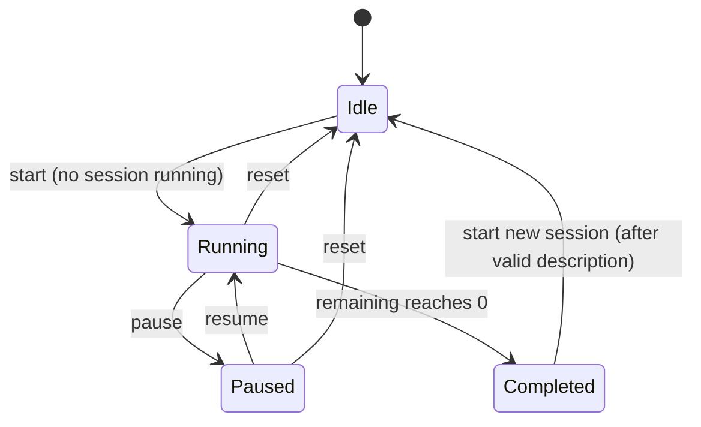

# Design Document

## Overview

Time Tracker is a single-page web application (SPA) that presents a countdown timer as its main
screen, records a log entry describing each completed session, persists that log in the browser,
and lets the user export the log as CSV or write entries directly to a Google Sheet.

The application is built with **TypeScript + React + TailwindCSS** using semantic HTML. The core
domain logic (timer state machine, validation, CSV serialization, log ordering) is implemented as
**pure, framework-independent modules** so it can be unit- and property-tested without a DOM. React
components are thin views over this logic, and side-effecting concerns (local storage, Google APIs,
wall-clock time) are isolated behind small interfaces so they can be mocked in tests.

Two design decisions shape the rest of the document and are called out early because they affect
correctness and security:

1. **Wall-clock-based countdown.** The timer computes remaining time from a target end timestamp
   (`endEpochMs - now`) rather than decrementing a counter on each tick. This keeps the displayed
   value within 1 second of true elapsed time (Requirement 3.3) even if the browser throttles
   timers in background tabs, and it makes pause/resume exact (Requirement 4).

2. **Google authorization persistence requires a backend.** Requirement 11 asks the authorization
   to persist "as long as possible" and auto-renew across browser restarts. A purely client-side
   SPA *cannot* securely hold a long-lived renewable credential (refresh token). This document
   recommends a lightweight Backend-for-Frontend (BFF) to hold the refresh token, and documents the
   tradeoff and a client-only fallback in the Architecture section.

## Architecture

### High-level structure

```mermaid
graph TD
    subgraph Browser SPA
        UI[React UI Layer]
        Timer[TimerEngine - pure state machine]
        Validation[Validation module - pure]
        CSV[CsvExporter - pure serialize/parse]
        LogSvc[ActivityLogService]
        LogStore[LogStore - localStorage adapter]
        AuthClient[AuthClient]
        SheetsClient[GoogleSheetsConnector]
        Clock[Clock - time provider]
    end

    subgraph Server (BFF - recommended)
        OAuth[OAuth code exchange + refresh]
        Session[(httpOnly session cookie)]
        SheetsProxy[Sheets API proxy]
    end

    GoogleOAuth[Google OAuth 2.0]
    SheetsAPI[Google Sheets API]

    UI --> Timer
    UI --> Validation
    UI --> LogSvc
    UI --> CSV
    UI --> AuthClient
    UI --> SheetsClient
    Timer --> Clock
    LogSvc --> LogStore
    AuthClient --> OAuth
    SheetsClient --> SheetsProxy
    OAuth --> GoogleOAuth
    OAuth --> Session
    SheetsProxy --> SheetsAPI
```

### Layering

- **UI layer (React).** Renders the timer, controls, activity prompt, log view, export and Google
  Sheets controls. Holds React state and delegates all decisions to the pure modules.
- **Domain layer (pure TypeScript).** `TimerEngine`, `validation`, `CsvExporter`, and the ordering
  logic in `ActivityLogService`. No DOM, no `Date.now()` call inside (time is injected via `Clock`),
  no network. This is the layer covered by property-based tests.
- **Infrastructure layer.** `LogStore` (localStorage), `Clock` (wraps `Date`/`performance.now`),
  `AuthClient`, and `GoogleSheetsConnector` (network). All are defined as interfaces so the domain
  and UI can be tested against in-memory fakes.

### Google authorization architecture decision

**Problem.** Requirement 11 requires the longest-lived renewable authorization, reused across
browser restarts, auto-renewed before expiry, with explicit sign-out clearing it. Google's browser
("token") model issues short-lived access tokens (~3600 seconds) and **does not return a refresh
token to JavaScript clients**. Renewable, long-lived access requires the OAuth 2.0 **authorization
code flow with `access_type=offline`**, whose authorization code is exchanged for a refresh token.
That exchange uses a client secret and must happen server-side; the resulting refresh token must
never be exposed to the browser.

**Options considered.**

| Option | Persistence | Renewal across restarts | Security | Verdict |
| --- | --- | --- | --- | --- |
| A. Client-only token model (GIS `initTokenClient`), cache access token in `localStorage` | Until access token expires (~1h); silent re-grant possible only while the Google session/cookies allow it | Weak — no refresh token; silent renewal blocked by third-party cookie restrictions; user re-consents | Refresh token never present, but access token in `localStorage` is exposed to XSS | Does **not** satisfy "as long as possible / across restarts" |
| B. **BFF holds refresh token (recommended)** | As long as the refresh token remains valid (effectively indefinite until revoked/unused ~6 months/password change) | Strong — server refreshes access tokens on demand and before expiry | Refresh token stored server-side; browser holds only an httpOnly, Secure, SameSite session cookie | **Recommended** |

**Recommendation: Option B (BFF).** A minimal backend exposes:
- `POST /auth/google/start` → returns the Google consent URL (scopes: `https://www.googleapis.com/auth/spreadsheets` plus `drive.file` for sheet creation, `access_type=offline`, `prompt=consent`).
- `GET /auth/google/callback` → exchanges the authorization code for access + refresh tokens, stores them in a server-side session keyed by an httpOnly Secure cookie (the `Auth_Store` of record), returns the user to the app.
- `GET /auth/status` → reports whether a valid authorization exists and its expiry, without exposing tokens.
- `POST /auth/signout` → revokes and deletes the stored tokens.
- `POST /sheets/*` → proxies Sheets calls, refreshing the access token first if it is near expiry.

In this model the browser-side `Auth_Store` holds **no secret** — only the session cookie (managed
by the browser) and non-sensitive status metadata (connected flag, expiry hint, target sheet id).
"Auto-renew before expiry" (11.4) is implemented server-side using the refresh token; "re-auth when
it cannot be renewed" (11.7) surfaces when a refresh attempt returns `invalid_grant`.

**Tradeoff documented.** Option B introduces a server component and an OAuth client secret to
manage, which is more operational surface than a static SPA. The benefit is that it is the only way
to honor the durability and security intent of Requirement 11; storing a refresh token in the
browser would be insecure and is explicitly avoided. **Fallback:** if no backend can be deployed,
Option A is implemented with the explicit, documented limitation that the connection lasts roughly
one hour of inactivity and may require periodic re-consent — and Requirement 11.4/11.7 are met only
on a best-effort basis. The remainder of the design assumes Option B and keeps the browser-side
`GoogleSheetsConnector` behind an interface so either backend can sit behind it.

## Components and Interfaces

### TimerEngine (pure state machine)

The timer is modeled as an explicit state machine over four states.



```typescript
type TimerStatus = 'idle' | 'running' | 'paused' | 'completed';

interface TimerState {
  status: TimerStatus;
  configuredDurationSec: number;   // 1..999 * 60, always valid
  remainingSec: number;            // 0..configuredDurationSec
  // Internal bookkeeping for wall-clock countdown:
  endEpochMs: number | null;       // target end time while running
  pausedRemainingSec: number | null;
  sessionStartEpochMs: number | null; // for Log_Entry start time
  sessionEndEpochMs: number | null;   // set when Completed
  usingDefaultFallback: boolean;   // Req 1.5 / 2.5 indication
}

interface TimerEngine {
  init(configuredDurationSec: number): TimerState;
  setDuration(state: TimerState, minutes: unknown): TimerState; // validates 1..999
  start(state: TimerState, nowMs: number): TimerState;
  pause(state: TimerState, nowMs: number): TimerState;
  resume(state: TimerState, nowMs: number): TimerState;
  reset(state: TimerState): TimerState;
  tick(state: TimerState, nowMs: number): TimerState; // recompute remaining; may transition to completed
}
```

Notes:
- `tick` recomputes `remainingSec = max(0, ceil((endEpochMs - nowMs)/1000))` while running, so the
  displayed value tracks wall-clock time (Req 3.3) and is robust to throttling.
- Invalid transitions (start while running, pause while not running, resume while not paused) return
  the state unchanged plus a flag the UI uses to show the "not applicable / already running"
  indication (Req 3.2, 4.5, 4.6). These are surfaced via a returned discriminated result rather than
  thrown exceptions.

### Validation module (pure)

```typescript
// Duration: whole minutes 1..999 (Req 2)
function parseDuration(input: unknown): { ok: true; minutes: number } | { ok: false };

// Activity description: trim, require 1..50 chars after trim (Req 6.4-6.6)
function validateDescription(input: string):
  | { ok: true; value: string }
  | { ok: false; reason: 'empty' | 'too_long' };

// Sheet name: 1..100 chars (Req 12.1, 12.5)
function validateSheetName(input: string):
  | { ok: true; value: string }
  | { ok: false; reason: 'empty' | 'too_long' };
```

### ActivityLogService and LogStore

```typescript
interface LogEntry {
  id: string;            // stable unique id (uuid)
  date: string;          // YYYY-MM-DD (session start date)
  startTime: string;     // HH:MM:SS 24-hour
  endTime: string;       // HH:MM:SS 24-hour
  description: string;   // trimmed, 1..50 chars
  startEpochMs: number;  // used for deterministic most-recent-first ordering
}

interface ActivityLogService {
  append(log: LogEntry[], entry: LogEntry): LogEntry[]; // pure: returns new array
  orderedForDisplay(log: LogEntry[]): LogEntry[];        // most-recent-first by startEpochMs
}

interface LogStore {
  load(): Result<LogEntry[]>;        // Req 9.2-9.4
  save(log: LogEntry[]): Result<void>; // Req 9.1, 9.5
}
```

`LogStore` serializes the log to JSON under a single localStorage key (`timeTracker.activityLog`).
The append-only invariant (Req 7.4) is enforced by the service: it never removes or mutates existing
entries; `append` only adds.

### CsvExporter (pure)

```typescript
interface CsvExporter {
  toCsv(log: LogEntry[]): string;        // RFC 4180, header row first (Req 10.1-10.3, 10.5)
  parseCsv(csv: string): LogEntry[];     // inverse used for round-trip property (Req 10.4)
}
```

Columns, in order: `date, start time, end time, description`. RFC 4180 escaping: any field
containing a comma, double quote, or CR/LF is wrapped in double quotes and internal double quotes
are doubled. Line terminator is `\r\n`.

### Google integration interfaces

```typescript
interface AuthClient {
  getStatus(): Promise<{ connected: boolean; expiresAtMs: number | null }>; // Req 11.3
  connect(): Promise<void>;     // launches consent flow (Req 11.1-11.2)
  signOut(): Promise<void>;     // Req 11.5
}

interface GoogleSheetsConnector {
  createSheet(name: string): Promise<TargetSheet>;        // Req 12.1-12.2
  selectSheet(sheetId: string): Promise<TargetSheet>;     // Req 12.3-12.4 (validates columns)
  appendRow(target: TargetSheet, entry: LogEntry): Promise<void>; // Req 13.1
}

interface TargetSheet {
  spreadsheetId: string;
  sheetTitle: string;
  hasRequiredColumns: boolean;
}
```

### React component tree

- `App` — loads persisted log and auth status on mount (Req 1.1, 9.2, 11.3).
- `TimerScreen` (main screen)
  - `DurationInput` (disabled while running; Req 2.1)
  - `TimerDisplay` (MM:SS, default-fallback badge; Req 1.3, 1.5)
  - `TimerControls` (Start / Pause / Resume / Reset; reset hidden when idle/completed per Req 5.4)
  - `ActivityPrompt` (modal shown on completion; Req 6)
- `ActivityLogView` (most-recent-first list; empty state; Req 8)
- `ExportBar` (CSV export button + confirmation/error; Req 10.6-10.7)
- `GoogleSheetsPanel` (connect/sign-out, sheet create/select, write status; Req 11-13)

A single React reducer drives `TimerState`; a 250 ms `setInterval` calls `tick` (Req 1.4, 3.3),
which is frequent enough to keep within the 200 ms responsiveness bounds (Req 4.1, 5.1) while the
displayed seconds still change once per second.

## Data Models

### Persistence schema (Log_Store)

```json
{
  "version": 1,
  "entries": [
    {
      "id": "f1c2...",
      "date": "2025-01-15",
      "startTime": "09:00:00",
      "endTime": "09:15:00",
      "description": "wrote design",
      "startEpochMs": 1736931600000
    }
  ]
}
```

- Stored under key `timeTracker.activityLog`. A `version` field allows future migration.
- On load, if the value is missing → empty log (Req 9.3); if present but unparseable → treated as a
  load failure: show retrieval error, present empty log in the UI, and do **not** overwrite the
  stored raw value (Req 9.4).

### Browser-side auth metadata (Auth_Store, Option B)

```json
{ "connected": true, "expiresAtMs": 1736935200000, "targetSheetId": "1AbC..." }
```

No tokens are stored in the browser. The session cookie (httpOnly, Secure, SameSite=Lax) is the
real credential handle and is managed by the browser, not by application JavaScript.

### Time and format conventions

- `date`: `YYYY-MM-DD` from the session start instant in the user's local time zone.
- `startTime` / `endTime`: 24-hour `HH:MM:SS`.
- Timer display: `MM:SS`, minutes `00`–`99`, seconds `00`–`59`, both zero-padded (Req 1.3). For the
  max 999-minute duration the minutes component may exceed 99; the display clamps minutes formatting
  to the documented MM range while the underlying remaining seconds remain exact (an explicit note,
  since 999 minutes = 16639:00 conceptually; the design renders total minutes with as many digits as
  needed and zero-pads to a minimum of two, keeping seconds in `00`–`59`).

## Correctness Properties

*A property is a characteristic or behavior that should hold true across all valid executions of a
system — essentially, a formal statement about what the system should do. Properties serve as the
bridge between human-readable specifications and machine-verifiable correctness guarantees.*

These properties target the pure domain layer (`TimerEngine`, `validation`, `ActivityLogService`,
`CsvExporter`, and the Sheets row mapping). Time is injected, so "now" is a generated input. The
Google sign-in, renewal, network, and UI-timing criteria are validated by integration and
example-based tests (see Testing Strategy), not property-based tests.

### Property 1: Duration validation and invariant

*For any* input value, `parseDuration` accepts it if and only if it represents a whole number of
minutes between 1 and 999 inclusive; and *for any* sequence of `setDuration` calls applied to a
timer, the effective configured duration is always a whole number of minutes in [1, 999], with
rejected inputs leaving the previous configured duration unchanged.

**Validates: Requirements 2.1, 2.3, 2.4, 2.6**

### Property 2: Idle remaining equals configured duration

*For any* valid configured duration, while no session is running (idle state) the timer's remaining
time equals the configured duration.

**Validates: Requirements 1.2, 2.3**

### Property 3: Start transition

*For any* idle timer with a valid configured duration, starting a session transitions to the running
state with remaining time equal to the configured duration.

**Validates: Requirements 3.1**

### Property 4: Tick correctness (wall-clock countdown)

*For any* running session with configured duration D and any elapsed wall-clock time t since start,
`tick` sets remaining time to `clamp(D − t, 0, D)` (within 1 second), remaining time is
non-increasing as t increases, and once t ≥ D the timer is in the completed state with remaining
time 0 and an end timestamp recorded.

**Validates: Requirements 3.3, 3.4, 3.5, 6.3**

### Property 5: Pause/resume preserves remaining time

*For any* running session, pausing captures the current remaining time; *for any* amount of elapsed
time while paused, ticking leaves the remaining time unchanged; and resuming continues from exactly
the captured remaining time with no time lost or added.

**Validates: Requirements 4.2, 4.3, 4.4**

### Property 6: Invalid transitions are no-ops

*For any* timer state, an action that is not applicable to that state (start while running, pause
while not running, resume while not paused) returns an equivalent state with the remaining time and
status unchanged, accompanied by a not-applicable indication.

**Validates: Requirements 3.2, 4.5, 4.6**

### Property 7: Reset transition creates no log entry

*For any* timer state, resetting transitions to the not-running state with remaining time equal to
the configured duration, produces no log entry, and subsequent ticks do not change remaining time or
status until a new session is started.

**Validates: Requirements 5.1, 5.2, 5.3**

### Property 8: Activity description validation

*For any* string, `validateDescription` accepts it if and only if its length after trimming is
between 1 and 50 inclusive; rejected strings report reason `empty` when the trimmed value is empty
and `too_long` when the trimmed length exceeds 50, and accepted strings yield the trimmed value.

**Validates: Requirements 6.4, 6.5, 6.6**

### Property 9: Clock-time field formatting

*For any* session start and end instants, the created log entry's `date` is the `YYYY-MM-DD`
representation of the start instant and `startTime`/`endTime` are the `HH:MM:SS` 24-hour
representations of the start and end instants respectively.

**Validates: Requirements 7.1, 7.2, 7.3**

### Property 10: Remaining-time display formatting

*For any* non-negative remaining-seconds value, the formatted display has the seconds component in
the range 00–59 zero-padded to two digits and the minutes component zero-padded to at least two
digits, and parsing the formatted string back yields the original whole-second value.

**Validates: Requirements 1.3**

### Property 11: Append and ordering preserve all entries, newest first

*For any* activity log and any new entry, appending the entry yields a log that contains every prior
entry unchanged plus the new entry; and *for any* activity log, the display ordering returns all
entries sorted from most recent to oldest by start time with no entry added or dropped.

**Validates: Requirements 7.4, 8.1**

### Property 12: Log persistence round-trip

*For any* activity log, saving it to the Log_Store and then loading it back yields a log that
matches the original field-by-field and preserves record count and order.

**Validates: Requirements 9.1, 9.2, 9.5**

### Property 13: CSV round-trip

*For any* activity log — including descriptions containing commas, double quotes, and line breaks —
exporting to CSV and parsing the CSV back produces log entries that match the original field-by-field
and preserve the original record count and order.

**Validates: Requirements 10.3, 10.4**

### Property 14: CSV structure and formatting

*For any* activity log, the produced CSV has the four-column header row (`date, start time, end time,
description`) as its first record, contains exactly one data record per log entry, and renders dates
as `YYYY-MM-DD` and times as `HH:MM:SS`.

**Validates: Requirements 10.1, 10.2**

### Property 15: Missing-column detection

*For any* existing-sheet header row, column validation accepts it if and only if it contains all four
required columns; when one or more are missing it reports exactly the set of missing required columns
and rejects the sheet.

**Validates: Requirements 12.4**

### Property 16: Sheet-name validation

*For any* string, `validateSheetName` accepts it if and only if its length after trimming is between
1 and 100 inclusive.

**Validates: Requirements 12.5**

### Property 17: Log entry to spreadsheet row mapping

*For any* log entry, the spreadsheet row produced for it is the array `[date, startTime, endTime,
description]` in that order, with date and times in 24-hour format.

**Validates: Requirements 13.1**

## Error Handling

The application treats domain errors as values (discriminated results) and reserves exceptions for
truly unexpected conditions. Each requirement-mandated failure path maps to a specific handling
strategy.

### Timer and validation

- Invalid duration input (Req 2.4): `parseDuration` returns `{ ok: false }`; the UI keeps the prior
  duration and shows an inline error. No exception is thrown.
- Invalid timer transitions (Req 3.2, 4.5, 4.6): handled as no-op results carrying a
  `notApplicable` / `alreadyRunning` reason that the UI renders as a transient indication.
- Invalid activity description (Req 6.5, 6.6): the prompt stays open, retains the entered text, and
  shows the appropriate validation message; submission is blocked until valid.

### Local storage (Log_Store)

- Save failure (Req 9.5): show a save-failed error; keep the appended entry in the in-memory log so
  it is still visible and can be retried on the next append/save.
- Load failure / corrupt data (Req 9.4): show a retrieval-failed error, present an empty log in the
  UI, and do **not** overwrite the existing raw stored value (avoid destroying recoverable data).
- Append-then-persist failure (Req 7.5): surface an error and retain the submitted description so the
  user can retry without re-typing.
- Display update failures (Req 8.4, 8.5): retry the view update up to 3 times while keeping the
  previously displayed entries; after 3 failures show an error and preserve existing log data.

### CSV export

- Export failure (Req 10.7): show an export-failed error and leave the log unchanged. Export is a
  pure transform plus a download trigger, so the only realistic failures are the browser download
  step; these are caught and reported.

### Google authorization and Sheets (Option B / BFF)

- Consent denied, failed, or no response within 120 s (Req 11.6): show a cause-specific error, leave
  the log unchanged, and keep a retry affordance.
- Stored authorization expired/revoked and not renewable (Req 11.7): the BFF refresh returns
  `invalid_grant`; the UI prompts re-authorization and withholds writes until it succeeds.
- Auth status save/retrieve failure in the browser (Req 11.8): show an error and allow re-sign-in;
  never modify the log.
- Write guards: no valid auth (Req 13.2) → withhold write, prompt sign-in; no target sheet
  (Req 13.3) → withhold write, prompt to create/choose a sheet.
- Write failure (Req 13.4): show a write-failed error and retain the unwritten entry in the log.
- Escalation (Req 13.5): when the failure itself cannot be surfaced/retained, retry up to 3 times at
  2-second intervals; if all fail, show a persistent error notification.
- Sheet selection without required columns (Req 12.4): show which columns are missing and keep any
  previously designated target sheet unchanged.

A small `ErrorBanner`/toast region in the UI renders these messages; persistent errors (Req 13.5)
use a non-auto-dismissing notification.

## Testing Strategy

The strategy combines property-based tests for the pure domain layer, example/edge-case unit tests
for specific behaviors and error paths, and integration tests (with mocks) for storage and Google
APIs. Property-based tests verify universal correctness; example tests pin down concrete behavior and
failure handling.

### Property-based tests

- Library: **fast-check** with Vitest (`@fast-check/vitest`), the standard PBT library for the
  TypeScript/React ecosystem. PBT is implemented using this library, not from scratch.
- Each of the 17 properties above is implemented as a **single** property-based test.
- Each property test runs a **minimum of 100 iterations** (`{ numRuns: 100 }` or higher).
- Each property test is tagged with a comment referencing the design property, using the format:
  `// Feature: pomodoro-timer, Property {number}: {property_text}`.
- Generators:
  - durations: integers across and outside [1, 999], plus non-integer/garbage inputs for the
    rejection cases.
  - timestamps/elapsed: arbitrary epoch milliseconds and non-negative elapsed durations.
  - descriptions: arbitrary unicode strings, strings padded with leading/trailing whitespace,
    all-whitespace strings, and adversarial strings containing commas, double quotes, and `\r\n`
    (covering the edge cases identified in prework for CSV and validation).
  - activity logs: arrays of generated entries, including the empty log.
  - sheet headers: permutations/subsets of the required and extra columns.

### Unit tests (examples and edge cases)

- Default duration is 15 minutes when unset (Req 2.2); fallback to 15:00 with indication when the
  configured duration is unavailable (Req 1.5, 2.5).
- Empty Log_Store loads as an empty log (Req 9.3); empty log exports as a header-only CSV (Req 10.5).
- Reset control hidden/disabled when idle or completed (Req 5.4); reset confirmation shows full
  duration (Req 5.5).
- Activity prompt copy is exactly "What did you do (1 or 2 words)?" and accepts 1–50 chars
  (Req 6.1, 6.2); new-sheet prompt defaults to "Time Tracker" (Req 12.1).
- Error-path units with injected failing fakes: append/persist retry and retention (Req 7.5, 8.4,
  8.5, 9.4, 9.5), CSV export failure (Req 10.7), auth-store failure (Req 11.8), Sheets write retry
  and escalation (Req 13.4, 13.5).

### Component / DOM tests

- React Testing Library with fake timers for render-and-timing behavior: timer present within
  initial render (Req 1.1), 1-second display updates (Req 1.4), pause/reset responsiveness
  (Req 4.1, 5.1), and live log updates on append (Req 8.3).

### Integration tests (mocked Google)

- OAuth flow against a mocked BFF/token endpoint: consent launch (Req 11.1), offline-access request
  and status persistence (Req 11.2), reuse without re-prompt (Req 11.3), pre-expiry renewal
  (Req 11.4), sign-out clears and forces re-auth (Req 11.5), denial/timeout handling (Req 11.6),
  `invalid_grant` re-auth prompt (Req 11.7).
- Sheets operations against a mocked Sheets API: create sheet with header row (Req 12.2), accept
  existing sheet with required columns (Req 12.3), guard writes without auth/target (Req 13.2, 13.3),
  append row within latency budget (Req 13.1). These run 1–3 representative examples rather than many
  iterations, since behavior does not vary meaningfully with input and calls are costly.
